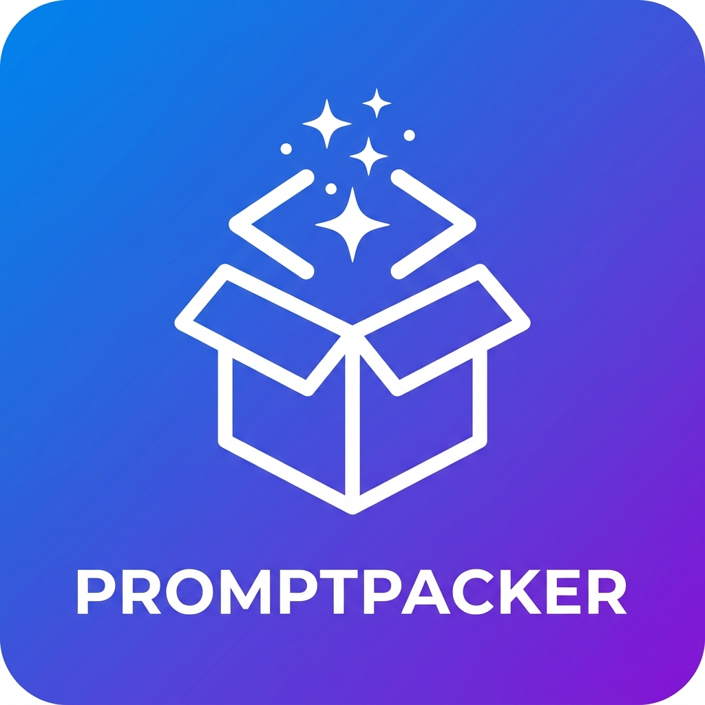

<div align="center">



# PromptPacker

**Combine files & folders into a single AI-ready prompt — right from VS Code.**

[](https://code.visualstudio.com/)
[](https://nodejs.org)
[](LICENSE)
[]()

> **Not on the VS Code Marketplace** — clone and build locally in ~2 minutes.

</div>

---

## What it does

Right-click any file or folder in the Explorer → **Add to PromptPacker** → paste the result into ChatGPT, Claude, Gemini, or any AI tool.

<table>
<tr>
<td><b>Plain text</b> <code>.txt</code></td>
<td>

```
======== FILES ========
*** src/index.ts ***
<file content>

*** src/utils.ts ***
<file content>
```

</td>
</tr>
<tr>
<td><b>Markdown</b> <code>.md</code></td>
<td>

```markdown
# Files

## src/index.ts

```typescript
<file content>
```

```

</td>
</tr>
</table>

---

## Installation

> **Prerequisites:** [Node.js 18+](https://nodejs.org) · [Git](https://git-scm.com) · VS Code 1.85+

### Step by step

```bash
# 1 — Clone
git clone https://github.com/KhairatMouhcine/PromptPacker.git
cd PromptPacker

# 2 — Install dependencies
npm install

# 3 — Build
npm run build

# 4 — Package
npm install -g @vscode/vsce
vsce package --no-dependencies
```

**5 — Install the `.vsix` in VS Code**

```bash
code --install-extension promptpacker-vscode-*.vsix
```

Or via the UI: **Extensions** (`Ctrl+Shift+X`) → `···` → **Install from VSIX…**

**6 — Reload**

`Ctrl+Shift+P` → **Developer: Reload Window**

---

## Usage

### Add files

| Action | How |
|--------|-----|
| Add a single file or folder | Right-click in Explorer → **Add to PromptPacker** |
| Add multiple files | `Ctrl+Click` to select → right-click → **Add to PromptPacker** |
| Open the panel | `Ctrl+Shift+P` → **PromptPacker: Open Panel** |

Folders are walked **recursively**. `.gitignore` rules and ignored directories are respected automatically.

### Export

From the PromptPacker panel:

| Button | Output |
|--------|--------|
| **Copy to Clipboard** | Plain-text prompt, ready to paste |
| **Download .txt** | `promptpacker-output.txt` |
| **Download .md** | `promptpacker-output.md` with fenced code blocks |
| **Clear All** | Resets the panel |

---

## Supported file types

<details>
<summary>View all supported extensions</summary>

<br>

| Category | Extensions |
|----------|------------|
| Code | `.js` `.jsx` `.ts` `.tsx` `.py` `.java` `.rb` `.php` `.go` `.rs` `.c` `.cpp` `.cs` `.swift` `.kt` `.scala` `.dart` `.lua` `.ex` `.r` `.pl` |
| Web | `.html` `.css` `.scss` `.sass` `.less` `.json` `.xml` `.yaml` `.graphql` |
| Config | `.env` `.toml` `.ini` `.tf` `.tfvars` `.hcl` `.proto` `.editorconfig` |
| Documents | `.pdf` `.docx` `.pptx` `.xlsx` `.xls` |
| Text | `.md` `.txt` `.tex` `.csv` `.tsv` `.sql` |
| Shell | `.sh` `.bash` `.zsh` `.fish` `.ps1` `.bat` `.cmd` |
| Frameworks | `.vue` `.svelte` `.astro` `.razor` `.jsp` `.pug` `.hbs` |

</details>

**Auto-skipped directories:** `node_modules` · `.git` · `dist` · `build` · `.next` · `__pycache__` · anything in `.gitignore`

---

## Notes

- Files **persist across sessions** (stored in workspace state)
- Documents (PDF, DOCX, PPTX, XLSX) are extracted **locally** — no data leaves your machine
- `.gitignore` rules are fully parsed and respected when walking folders

---

<div align="center">

<br>

**Mouhcine Khairat**

[GitHub](https://github.com/KhairatMouhcine) · MIT License

</div>
